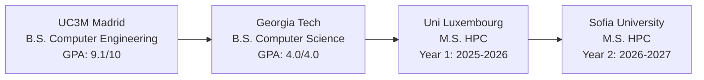

# 👋 Hello World, I'm Eduardo Rodríguez Sánchez

  
  
  
  

    
    
    
  

---

## 🚀 About Me

> *"Forty-two, said Deep Thought, with infinite majesty and calm."*

I'm a passionate Computer Engineer currently pursuing my Master's in High-Performance Computing through the prestigious **EUMaster4HPC** program. With experience in developing software for critical systems, I specialize in **optimizing OS-linked components** and **handling network-related tasks** at scale.

🎓 **Current Journey**: M.S. in HPC at Université du Luxembourg (2025-2026)  
🌍 **Location**: Madrid, Spain → Luxembourg → Sofia  
💼 **Current Role**: Research assistant in the workgroup Critical and Extreme Security and Dependability (CritiX)
🔬 **Research Interests**: Distributed Systems, Network Optimization, Parallel Computing

---

## 🎯 What I Do

<table>
<tr>
<td width="50%">

### 🔧 Systems Engineering
- **Low-level Programming** in C/C++
- **Kernel Development** & Virtualization
- **Memory Management** & IPC
- **Performance Optimization**

</td>
<td width="50%">

### 🌐 Network & Distributed Systems
- **5G Core Development** & RAN Systems
- **Load Balancing** at Scale 
- **Kubernetes** & Container Orchestration
- **Network Traffic Analysis** & Optimization

</td>
</tr>
</table>

---

## 🌟 Current Focus

- 🔬 **HPC Research**: Exploring parallel computing paradigms and distributed algorithms
- 🌐 **5G Innovation**: Advancing next-gen network architectures
- 🚀 **Systems Optimization**: Pushing the boundaries of low-latency, high-throughput systems
- 📖 **Learning**: CUDA programming, MPI, and advanced parallel computing techniques

---

## 💻 Tech Stack & Skills

### Languages

### Systems & Infrastructure

### Tools & Monitoring

---

## 📚 Educational Journey

---

## 📊 GitHub Stats

  
  

  

---

  
### 📫 Let's Connect!

I'm always excited to discuss **systems programming**, **HPC challenges**, or **collaborative opportunities**!

